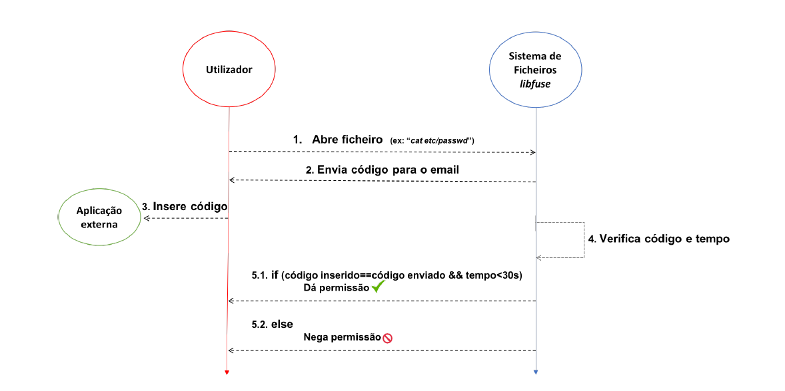

# Autorização de Oreações ao nível do Sistema de Ficheiros

Projeto Segurança de Sistemas Informáticos 2018/2019, Mestrado Integrado em Engenharia Informática, Universidade do Minho, Braga - Portugal

Este projeto tem como objetivo complementar os mecanismos de controlo de acesso de um sistema de ficheiros tradicional do sistema operativo Linux com um mecanismo adicional de autorização de operações de abertura de ficheiros. O sistema desenvolvido é concretizado sob a forma de um novo sistema de ficheiros baseado em libfuse.

### Como executar o sistema

  - Instalar package do python:
```
sudo apt-get install python3-dev;
```
  - Pôr o servidor à escuta na porta 12345:
    - Na diretoria validationServer:
```
npm start
```
  - Compilar o sistema de ficheiros:
  
```
gcc -Wall passthrough.c `pkg-config fuse3 -cflags -libs python3` -o passthrough
```

  - Executar o sistema de ficheiros:
```
  mkdir FileSystem
  ./passthrough /FileSystem
```
- Testar o programa:  
  - Por exemplo, 
```
cat FileSystem/etc/passwd
```
  

### Arquitetura do sistema



## Autores

* [Joel Rodrigues](https://github.com/JoelRodrigues58)
* [Fábio Araújo](https://github.com/narcos88)
